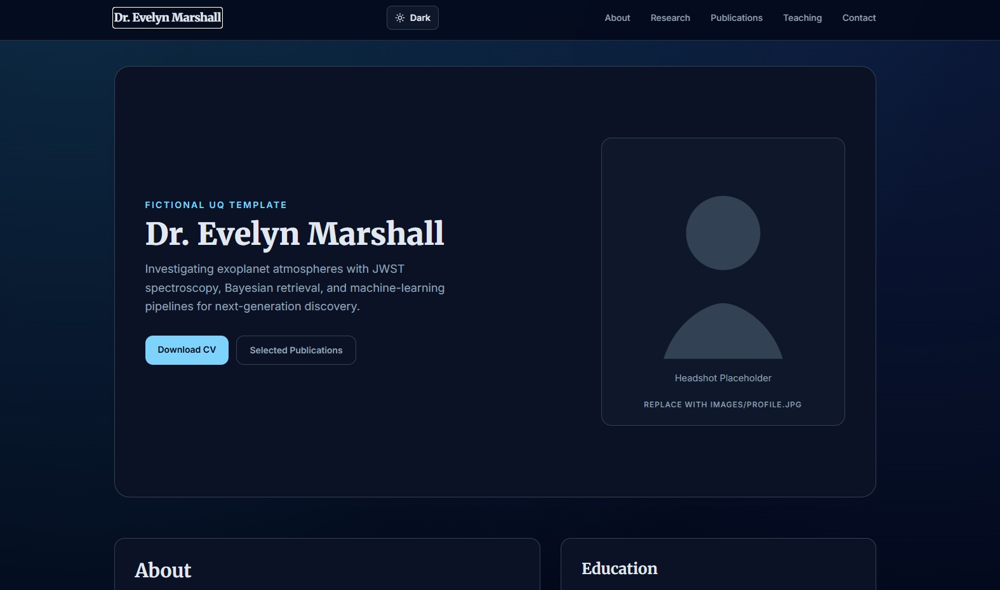

  <h1>🎓 Academic Portfolio Template</h1>
  
A sleek, professional, and easily customizable purely static website template designed for academic researchers, PhD students, and developers.

  <a href="#-features">Features</a> •
  <a href="#-getting-started-local-development">Getting Started</a> •
  <a href="#%EF%B8%8F-step-by-step-customization-guide">Customization</a> •
  <a href="#-hosting-on-github-pages-free-deployment">Deployment</a>

    
  

SimpleAstro by Mitch
Free for personal and commercial use under the CCA 3.0 license (html5up.net/license)

Shared Components (Project Customization)

	This project now uses shared navbar/footer components so you only edit them once:

	- Source file: assets/js/site-components.js
	- Pages using shared components: index.html, about.html, research.html, publications.html

	How to update navbar globally:
	- Edit renderModernHeader() and/or renderLegacyHeader() in assets/js/site-components.js
	- Save once; all pages inherit the change.

	How to update footer globally:
	- Edit renderModernFooter() and/or renderLegacyFooter() in assets/js/site-components.js
	- Save once; all pages inherit the change.

	Other good candidates to componentize next:
	- Section heading block (kicker + title + subtitle)
	- Reusable CTA button rows
	- Profile/social links strip
	- Reusable card shell for research/publication entries
	- Timeline item rows for education/career sections

Fictional Astrophysicist Starter Profile

	This template now ships with a fictional UQ-inspired persona:
	- Name: Dr. Evelyn Marshall (fictional)
	- Domain: Exoplanet atmospheres and computational astrophysics
	- Purpose: a realistic starter profile for Queensland astrophysics students

	If you are adapting this for any Queensland university (UQ/QUT/Griffith/JCU/USQ/etc.),
	replace these fields first:

	1. Name/title and profile image
	2. Email, office, ORCID, and social links
	3. University, school/department, and affiliation text
	4. Education timeline and awards
	5. Research interests, project cards, and publication entries
	6. Teaching courses and student supervision list

	Main identity sources:
	- assets/js/site-components.js (shared header + footer)
	- index.html (hero + homepage summary content)
	- about.html, research.html, publications.html (long-form profile sections)